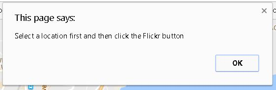

# Udacity-Neighbourhood-Map
You will develop a single-page application featuring a map of your neighborhood or a neighborhood you would like to visit.You will then add additional functionality to this application, including: map markers to identify popular locations or places you’d like to visit, a search function to easily discover these locations, and a listview to support simple browsing of all locations. You will then research and implement third-party APIs that provide additional information about each of these locations (such as StreetView images, Wikipedia articles, Yelp reviews, etc).

### Instructions to use
---

To run this app, clone/download this repository to your local machine. Open 'index.html' in your browser.

On the screen, you will see a map of Mumbai, India. A few interests of tourist locations are pre-selected.

1. Location can be selected by directly clicking on the map or by selecting from the top-left drop-down list.
2. After selecting the location, the location will get centered on the screen and a pop-up box with some information will appear above the location.
3. You can also narrow down the list of markers by typing in the search bar.
4. After selecting the  location, you can then click the bottom-left 'Flickr' icon. It will show you the photos relevant to the location selected... from the Flickr Photo Feed.

**Important Notes about Flickr API:**

* Clicking on a location from the list or marker directly shows RELEVANT location details from a third-party API service (Flickr images).
* They are stored in the 'lightbox' instead of 'infoWindow' (with 'show on click' option made available)
* If you don't select any location, you get an ALERT message shown below on clicking the 'Flickr' icon on the bottom-right corner.
Logo: 

### Use of APIs
---

I have used the following APIs for this project:

* Google Maps Javascript API
* Google Maps Geocoding API
* Flickr API

### References
---

Google Maps API - https://developers.google.com/maps/documentation/javascript/tutorial

Flickr API usage - https://www.flickr.com/services/api/

Utility Functions in KnockoutJS - http://www.knockmeout.net/2011/04/utility-functions-in-knockoutjs.html

Knockout lightbox - http://tech.pro/tutorial/1575/knockoutjs-lesson-14-adding-a-lightbox

Free Vector Icon Pack - https://github.com/Keyamoon/IcoMoon-Free